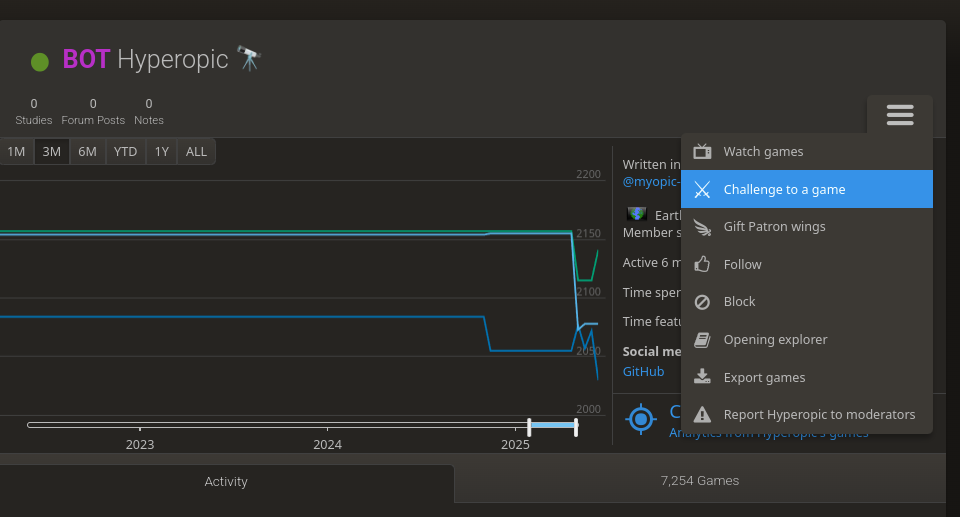

# Hyperopic chess engine

---


### Overview

This repository contains a mixture of libraries and applications which combine
to form an amateur chess engine which is playable by anyone around the world at
any time via the best website for playing chess [lichess.org](lichess.org). All
of the application code is written in [rust](rust-lang.org). The infrastructure
is provided by AWS and provisioned programmatically using the typescript flavour
of their [cloud development kit](https://aws.amazon.com/cdk/).

The main engine deployment is mostly serverless and uses a couple of lambda
functions alongside a dynamodb table for opening moves. The first lambda tracks the
progress of a game and calls the second to compute our move when needed. The
Lichess API model is pull based and requires a process polling an event stream
constantly to detect and respond to challenges, so this is running on a tiny ECS
cluster. The aim is to have 99.9% availability for accepting challenges subject to
max concurrent games limit on Lichess.

---

### Challenging the bot

You need an account on lichess.org which is completely free and just requires an
email address. To challenge Hyperopic to a game, visit its 
[profile page][1], select the "Challenge to a game" button (like in the screenshot 
below) and choose your game parameters.



Some things to note about the parameters of the game:

- Only the "Standard" variant is supported
- You can only play "Real time" games against the bot, i.e. games with a clock,
  to constrain the use of AWS resources to keep within the free tier
- The minutes per side supported is 1–5 inclusive, and the increment supported
  is 0–5 inclusive 
- A rate limit of 5 games per day per user is enforced

[1]: https://lichess.org/@/Hyperopic

---

### Building the project

Cargo is used as the build tool, you will require a rustc version >= 1.86.0. Hyperopic has a UCI compliant CLI interface
which allows the bot to integrate with other existing applications. To build and test the project use the following 
commands:

```shell
# Build all modules
cargo build

# Run all module tests
cargo test

# Build the UCI compliant CLi interface, the output binary will be at target/release/hyperopic-cli
cargo build --bin hyperopic-cli --release
```

